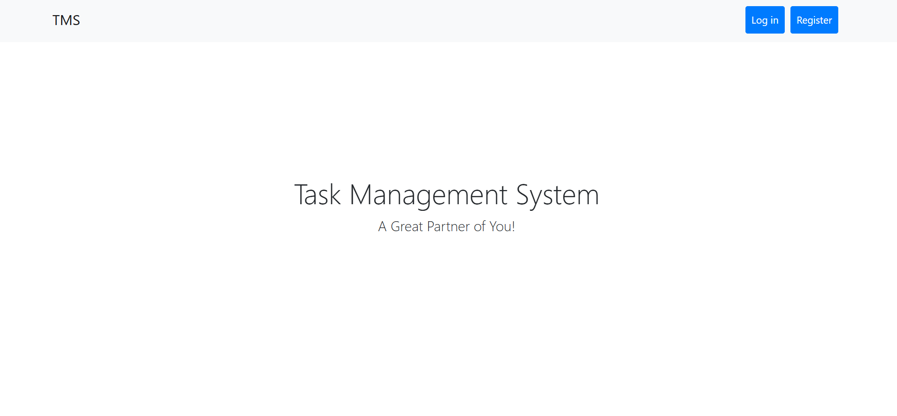

# Task Management System

A **Task Management System** built with Laravel 9, design for efficient and user centric task management. This application allows users to manage their tasks in a structured and intuitive mannar. 

## Features
### User Management
- **Registration, Login, Logout**: Secure user authentication with Laravel's built-in authentication features.
- **User-Specific Tasks**: Each user can only view and manage their own tasks.

### Task Management
1. **Task Visibility**: User can only access their own tasks.
2. **Task Sorting**: Tasks are displayed in the following order:
   * Pending
   * In Progress
   * Completed.
4. **CRUD Operations**: Create, Update, Delete tasks.

### Search Functionality
* Quickly Search Task by name, status or date.

### API Integration
* RESTful API endpoints to allow external systems to integrate seamlessly.
  
## Installation
### Requirements
    * PHP: >= 8.0
    * Composer: Installed on your system
    * Database: MySQL
    * Node.js: Required for frontend assets compilation

## Steps
Follow these steps to run the application.
1. **Clone the repository**: https://github.com/sagor-askar/task-management
2. **Navigate to the project directory**: cd task-management
3. **Install dependencies**:
       composer install
       npm install && npm run dev
4. **Generate the application key**: php artisan key:generate
5. **Run migrations**: php artisan migrate
6. **Start the development server**: php artisan serve

Access the application at **http://localhost:8000**

___

## Usage
### Task Management
* **Add Tasks**: Fill in the required fields (Task Name, Start Date, End Date). User ID & Status will be automatically inserted.
* **Edit Tasks**: Modify existing tasks from the Dashboard.
* **Delete Tasks**: Remove tasks no longer needed.

### Task Status
* **Pending**: Newly added tasks default to "Pending".
* **In Progress**: Update task status to indicate ongoing work.
* **Completed**: Mark tasks as "Completed" when finished.

### Search 
* Use the search bar to filter tasks by Name, Status, Date

### API Endpoints 
* **Base URL**: /api/tasks
* **Example Endpoints**:
    - **base url/tasks** (GET) : Retrieve all tasks for the authenticated user.
    - **base url/tasks** (POST) : Add a new task.
    - **base url/tasks/{id}** (PUT) : Update a task.
    - **base url/tasks/{id}** (DELETE) : Delete a task.

## Technology Used
### Backend 
* **Laravel 9**: Robust PHP framework for building scalabe application.
* **MySQL**: Database for storing user and task data.

### Frontend
* **Blade Templates**: Simple and powerful templating engine.
* **Bootstrap 4**: Responsive design & styling.

### Tools
* **Laravel Sanctum**: For API authentication.
* **DataTables**: Enhance tables with sorting, filtering, and pagination. 

